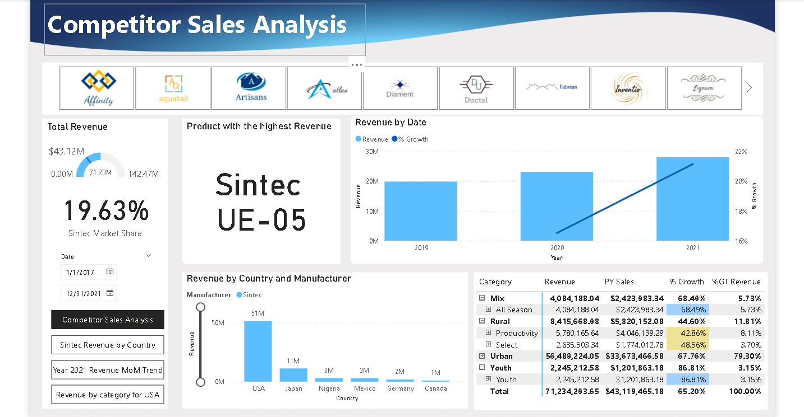
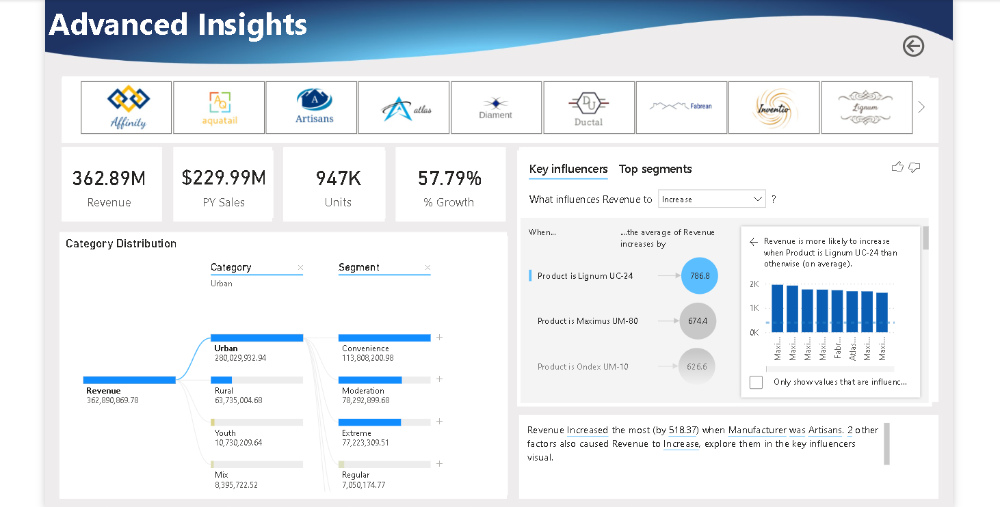

# 📊 Power BI Competitor Sales Analysis

**Project Type**: Business Intelligence Case Study  
**Tool**: Microsoft Power BI  
**Domain**: Manufacturing / Sales Performance / Market Share  
**Case Study Source**: DataCamp Guided Project

---

## 🧠 Project Overview

This project focuses on developing a fully interactive **Competitor Sales Analysis** dashboard for a fictional manufacturing company, **Sintec**, aiming to monitor internal sales performance and benchmark it against top competitors in global markets.

The report enables business users to:
- Identify top competitors by revenue
- Track year-over-year growth
- Visualize performance across product categories and countries
- Analyze market share trends
- Drill into advanced AI-powered insights

---

## 🗂️ Dataset Summary

The dataset includes sales data across multiple countries (USA, Germany, Mexico, etc.) from 2017 to 2021, along with supporting dimension tables:
- **Sales** (Fact table)  
- **Product** (Dim)  
- **Manufacturer** (Dim)  
- **Geography** (Dim)  
- **Date** (DAX-generated Dim)

The final model follows a **snowflake schema** with custom keys and calculated relationships.

---

## 🔧 Tools & Techniques Used

| Area | Tools & Features |
|------|------------------|
| **Data Loading** | Power Query, Folder connector, CSV + Excel imports |
| **Data Cleaning** | Fill down, split columns from examples, type conversion, transposition |
| **Data Modeling** | Snowflake schema, calculated columns, relationship creation, Date table with `CALENDAR()` |
| **DAX Measures** | YTD, PY Sales (`SAMEPERIODLASTYEAR()`), % Growth, Market Share |
| **Visualizations** | Stacked & Clustered Column Charts, Matrix, Treemap, Gauge, Card |
| **AI Visuals** | Smart Narrative, Key Influencers, Decomposition Tree |
| **Interactivity** | Slicers, Drillthrough, Bookmarks, Buttons, Spotlight |
| **Design** | Custom JSON theme, background images, logos in slicers |

---

## 📈 Key Business Insights

- Sintec holds **21.15% global market share**, with **38.22% in the USA**.
- **Artisans** is the top competitor in **Germany**, with over **50% market share**.
- Q1 of 2021 had the **highest revenue growth** at **18.8% YoY**.
- Top-performing categories and segments were identified using hierarchical and AI-based visuals.

---

## 💡 Business Questions Answered

- Who are the top 5 competitors by revenue?
- Which products and segments perform best by region?
- What is Sintec's year-over-year sales growth?
- What is Sintec’s market share globally and by country?
- What factors most influence revenue growth?

---

## 📸 Report Preview

---

## 🗺️ Navigation Features

- **Bookmarks & Spotlight** for storytelling mode
- **Slicers** with manufacturer logos and date filters
- **Drillthrough** for deep-dives by country
- **Custom themes** and professional UI design

---

## 🧠 Learnings & Skills Demonstrated

- Real-world BI project structure: load → transform → model → visualize
- End-to-end Power BI workflow
- Business-oriented DAX calculations
- Data storytelling for executive insights
- Use of AI visuals for enhanced analysis

---

## 🚀 Next Steps

- Deploy the report to Power BI Service
- Enable row-level security (RLS) for different regional managers
- Connect to live cloud data sources (SQL, Azure)

---

